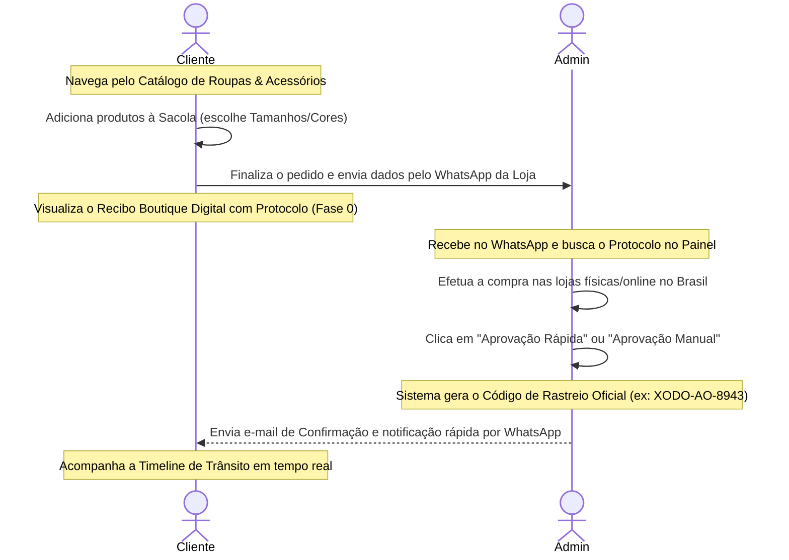

# 🌸 Xodó da Pretinha — Sistema de Marketplace & Rastreio

<div align="center">
  

  [](https://vercel.com/)
  [](https://supabase.com/)
  [](https://nodejs.org/)
  [](https://expressjs.com/)
  [](https://styles.css)
</div>

---

## 📖 Sobre o Projeto

O **Xodó da Pretinha** é um ecossistema digital híbrido de **Marketplace, Redirecionamento e Compras Assistidas** que serve como ponte entre compradores em Angola e o comércio no Brasil. 

A plataforma foi desenvolvida para oferecer uma experiência de compra sofisticada e fluida para os clientes, combinando um catálogo digital integrado com uma gaveta de sacola interativa. Do lado operacional, fornece ao administrador um painel completo para gerenciar o estoque local, monitorar os protocolos de compra recebidos e aprovar pedidos de rastreamento com fluxos de comunicação por e-mail e WhatsApp integrados.

---

## 🔄 Fluxo de Operação e Logística

O ciclo de vida da compra é dividido em duas grandes etapas: **Geração de Protocolo** (pelo cliente) e **Aprovação & Rastreamento** (pelo administrador).



---

## ✨ Recursos Principais

### 🛍️ Área Pública do Cliente (E-commerce)
- **Boutique Catalog Grid:** Visualização premium de peças de vestuário com fotos em alta definição, preços sugeridos em Kwanzas (AOA) e moeda de origem (BRL).
- **Sacola Deslizante (Cart Drawer):** 
  - Gaveta responsiva com efeito de desfoque de vidro (*Glassmorphism*).
  - Seleção dinâmica de tamanhos (**PP, P, M, G, GG, XG**) e cores customizadas por item.
  - Ajuste rápido de quantidades e cálculo de subtotal automático em tempo real.
- **Recibo Digital Premium:** 
  - Visualização de sucesso estruturada como um cupom fiscal de boutique com borda tracejada.
  - Exibe detalhadamente cada item solicitado com seu tamanho, cor e respectivo subtotal.
  - Botão integrado **"Confirmar no WhatsApp"** que formata os dados do carrinho e os envia ao suporte com um visual estruturado e profissional.
- **Portal de Rastreio:** Timeline interativa de 5 fases com animações dinâmicas e paleta de cores harmoniosa para o acompanhamento dos pacotes.

### 👑 Painel Administrativo de Controle
- **Dash Bento-Grid:** Estatísticas instantâneas de encomendas cadastradas, itens em trânsito, entregas concluídas e estimativas financeiras.
- **Gestão do Catálogo de Peças (CRUD):** Interface intuitiva para adicionar, buscar, editar status de disponibilidade ("Disponível" / "Sem Estoque") e excluir produtos da vitrine.
- **Aba de Protocolos Pendentes (Fase 0):** Listagem e inspeção detalhada de pedidos de cotação enviados por clientes.
- **Aprovação com 1 Clique (Fast-Approval):** 
  - O administrador clica em *"Aprovação Rápida"* para aprovar e gerar um código de rastreio instantaneamente.
  - Abre uma janela pós-aprovação de sucesso contendo o novo código, botão de cópia rápida e botão **"Notificar Cliente"** que encaminha o código e o link da encomenda diretamente no WhatsApp do comprador.

---

## 🛠️ Stack Tecnológica e Arquitetura

- **Interface:** HTML5 Semântico, CSS3 (variáveis dinâmicas HSL e responsividade touch-first), Vanilla ES6+ Javascript (SPA Router).
- **Backend:** Node.js com Express para serviços serverless rápidos.
- **Banco de Dados:** **Supabase Cloud (PostgreSQL)** com tabelas relacionais de pedidos, histórico e catálogo.
  - *Fallback inteligente:* Se as credenciais do Supabase estiverem offline ou em desenvolvimento local, o backend altera as rotas de gravação de forma transparente para arquivos locais `JSON`.
- **Comunicação:** **Resend** (API transacional) ou **Gmail SMTP** (para envio de notificações sem domínio próprio de forma gratuita).

---

## 📁 Estrutura do Repositório

```text
Ratreio/
├── api/
│   └── index.js             # Servidor Express & Endpoints da API (Serverless Function)
├── data/
│   ├── orders.json          # Arquivo de dados de backup local (pedidos/protocolos)
│   └── products.json        # Arquivo de dados de backup local (catálogo)
├── templates/
│   ├── 0_protocol.html      # Template de e-mail de Novo Pedido (Fase 0)
│   ├── 1_acquisition.html   # Template de e-mail de Compra Efetuada (Fase 1)
│   ├── 2_packaging.html     # Template de e-mail de Embalagem & Selação (Fase 2)
│   ├── 3_shipping.html      # Template de e-mail de Despacho Aéreo (Fase 3)
│   └── 4_reception.html     # Template de e-mail de Entrega Concluída (Fase 4)
├── app.js                   # Lógica da Single Page Application (SPA) e Eventos DOM
├── index.html               # Estrutura HTML do ecossistema e modais
├── styles.css               # Design Visual, animações, tema Glassmorphism e Print Styles
├── supabase_schema.sql      # Estrutura de Tabelas e sementes iniciais para o Banco Postgres
├── vercel.json              # Mapeamento e roteamento de APIs para o Vercel Serverless
└── package.json             # Dependências e scripts de desenvolvimento
```

---

## 🚀 Instalação e Execução Local

### 1. Clonar o Repositório e Instalar Dependências
```bash
git clone https://github.com/xododapretinha-design/xodo-da-pretinha-rastreio.git
cd Ratreio
npm install
```

### 2. Configurar Variáveis de Ambiente
Duplique o arquivo `.env.example` para `.env` na raiz do projeto:
```bash
cp .env.example .env
```
Abra o arquivo `.env` e configure as credenciais locais:
- `ADMIN_PASSWORD`: Senha administrativa de acesso ao painel.
- `JWT_SECRET`: Chave privada para encriptação da sessão JWT do admin.
- `SUPABASE_URL` / `SUPABASE_ANON_KEY`: URL e chave anônima do projeto Supabase. 
  *(Opcional localmente: se mantiver os valores de exemplo, o servidor usará dados locais da pasta `/data`)*

### 3. Executar o Servidor Local
```bash
npm run dev
```
Acesse o sistema localmente em: `http://localhost:8080`

---

## ☁️ Implantação e Deploy em Produção

### 1. Configurar Banco de Dados no Supabase
1. Crie um novo projeto no [Supabase](https://supabase.com/).
2. Abra o menu **SQL Editor** no painel lateral e clique em **New Query**.
3. Copie o script SQL do arquivo [supabase_schema.sql](file:///Users/fr.utxicascj/Desktop/Ratreio/supabase_schema.sql) deste repositório, cole no editor e clique em **Run**. Isto criará a estrutura física de tabelas e carregará dados sementes.

### 2. Configuração de Notificações por E-mail (Escolha uma opção)

#### Opção A (Recomendada para Dev/Testes): Usar Gmail SMTP
Ideal se você não tem um domínio próprio verificado. Permite o envio de e-mails usando sua conta Gmail de forma gratuita:
1. Acesse as configurações da sua **Conta Google**.
2. Vá em **Segurança** e ative a **Verificação em duas etapas**.
3. No campo de busca de sua Conta Google, pesquise por **Senhas de app**.
4. Crie uma nova senha escolhendo um nome personalizado (ex: "Xodó Notificações").
5. O Google fornecerá uma chave de **16 caracteres**. Copie-a.
6. Configure as variáveis na Vercel:
   - `GMAIL_USER` = `seu-email@gmail.com`
   - `GMAIL_APP_PASS` = `chave-de-16-caracteres`

#### Opção B (Recomendada para Produção): Usar Resend API
Recomendada se você possui um domínio próprio verificado (ex: `boutique@xododapretinha.shop`):
1. Cadastre-se no [Resend](https://resend.com/).
2. Em **Domains**, adicione o domínio do seu site e configure as chaves DNS fornecidas no seu registrador de domínio.
3. Obtenha a API Key em **API Keys**.
4. Configure as variáveis na Vercel:
   - `RESEND_API_KEY` = `re_sua_chave`
   - `EMAIL_FROM` = `Xodó da Pretinha <sua-conta-verificada@seu-dominio.com>`

### 3. Deploy na Vercel
1. Conecte sua conta do GitHub na [Vercel](https://vercel.com/).
2. Importe o repositório do projeto.
3. Nas **Environment Variables** (Variáveis de Ambiente), configure:
   - `ADMIN_USER` = `admin`
   - `ADMIN_PASSWORD` = `sua-senha-admin`
   - `JWT_SECRET` = `seu-segredo-de-sessao`
   - `SUPABASE_URL` = `https://seu-projeto-supabase.supabase.co`
   - `SUPABASE_ANON_KEY` = `sua-chave-anon-supabase`
   - E as chaves de e-mail correspondentes à **Opção A** ou **Opção B** detalhadas acima.
4. Clique em **Deploy**. A Vercel construirá a aplicação serverless e fornecerá um endereço HTTPS seguro.

---

## 🔒 Segurança e Práticas
- **Zero Vazamentos:** O arquivo `.env` está configurado explicitamente no `.gitignore` para impedir o commit de chaves secretas.
- **Serverless-First:** Toda lógica de backend Express foi preparada para funcionar sob demanda no Vercel Functions, eliminando a manutenção de servidores ativos 24/7.

---

## 🖤 Licença
Este sistema foi projetado e construído com carinho para o ecossistema comercial da boutique **Xodó da Pretinha**. Todos os direitos reservados.
